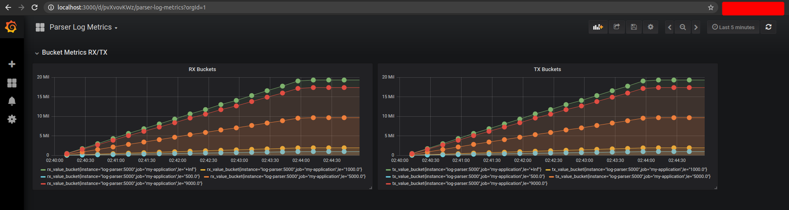

# Log Generator Samples for Monitoring Tools

The following script will generate random logs from a specific epoch date.
In order to avoid any issues please make sure you provide the required libraries by running:

```
pip install -r requirements.txt
```

## Running scripts separately
On the root folder, start the logs generator with the following command:

### Log Generator

logs.py makes use of python generators to write in 24 hrs batches to the samples.log. Beware that the size of the file could be around 1.6GB since we're generating logs from `GMT: Wednesday, February 19, 2020 11:59:59 PM`

You can modify this value changing the line 22 of `log.py` if you want to generate a smaller sample.
```
values = log_gen(1582156799)
```

If you are not aware of the timestamp format go to [EpochConverter](https://www.epochconverter.com/)

To execute it run:

```
python logs.py
```

Expected Output:
```
=======================================================================================
--- Generation Completed in 46.550165 seconds ---
=======================================================================================
```

### Log Parser

Once the file has been generated, you can execute the parsing server and expose the metrics in Prometheus format running:

```
export FLASK_APP=parser.py
flask run -h 0.0.0 -p 8081
```

This will generate a log output when the log parsing is completed, you can then check the metrics in plain text by opening the url
http://localhost:8081/metrics in your browser

Expected Output:
```
flask run -h 0.0.0 -p 8081
 * Serving Flask app "parser.py"
 * Environment: production
   WARNING: This is a development server. Do not use it in a production deployment.
   Use a production WSGI server instead.
 * Debug mode: off
=======================================================================================
--- Parse completed in 92.224037 seconds ---
=======================================================================================
```

## Using Docker Compose to view dashboards

If you haven't, generate log samples by running:
```
python log.py
```

You can then run the parser application in a container to forward metrics over Grafana and feed a pre configured dashboard called `Parser Log Metrics`. However keep in mind that performance will be affected since we will be reading line by line on a file with multiple json structure from where we extract the 2 metrics (RX/TX).

To execute the application go to the `docker-compose` folder and run:

```
docker-compose up --build
```
Optionally if you want to run containers in detached mode, add the -d flag

```
docker-compose up --build -d
```

Once the flask server is up you can access the parser app by using the following links:
```
http://localhost:8081         # for instructions
http://localhost:8081/parse   # to trigger the parsing job and feed metrics to grafana
http://localhost:8081/metrics # to see metrics in plain text
```

## Check Dashboards on Grafana

Once the parsing job has been triggered, you can open Grafana on port 3000, click here to see a pre-configured [Dashboard](http://localhost:3000/d/pvXvovKWz/parser-log-metrics?orgId=1)



## Run your Own Prometheus Queries

```
http://localhost:9091
```


## Clean up

Once you have finished testing the app, remember to stop existing docker containers by running:
```
docker-compose down
```

Additional Resources:
[grafa-data section inspired by](https://github.com/marcel-dempers/docker-development-youtube-series)
